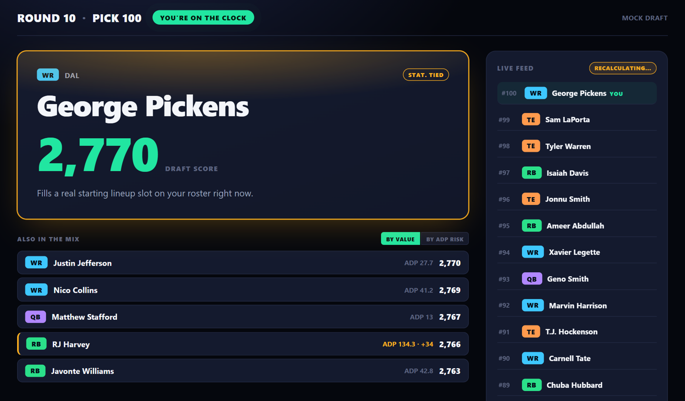

# FF Draft Assistant

A live fantasy-football draft assistant that watches a Sleeper draft in real time and recommends the next pick. Instead of just ranking players by projected points, it simulates the draft forward, adjusts for risk, and returns a single "Draft Score" with a one-line explanation of why.

Built for one specific league (10 teams, snake draft, full PPR, SUPERFLEX, TE premium) and used as a second screen: you make the pick in Sleeper, the app watches and advises.

## What it does



*Mock-draft mode with simulated opponents: the big card is the recommended pick and its Draft Score, "Also in the mix" lists the runners-up (amber marks a pick that is likely to still be there next round), and the right column is the live pick feed.*

The decision pipeline, end to end:

1. **Projections**: recency-weighted three-season projections from `nfl_data_py`, scored with the league's real settings.
2. **Value over replacement (VBD)**, adjusted for SUPERFLEX, where a naive VBD badly overvalues quarterbacks.
3. **Correlated Monte Carlo**: log-normal weekly outcomes at the player and roster level.
4. **MCTS draft search**: Monte Carlo tree search over the picks to come, with an opponent model (ADP proxy x positional need).
5. **Risk adjustment**: a Markowitz-style penalty, plus lineup awareness (bench depth is discounted, with rank-decaying discounts by position).
6. **Shapley values** as the explanation layer (marginal contribution of the pick), kept separate so the headline number stays a single score.

On top of that sit a live Sleeper feed over WebSockets (picks pushed as they happen), mock-draft simulation, lineup optimization, waiver and trade evaluation, and draft-day targets.

## Results and validation

A full 15-round, 10-team mock-draft harness runs "my" team with three strategies against identical opponent behavior. In the first validation (3 seeds), the Draft Score averaged a risk-adjusted **3,339** versus **3,174** for VBD-only and **3,138** for ADP-only, and it won in all three seeds. The same harness found and led to a fix for a quarterback over-drafting bug (QB counts dropped from 8/5/7 to 1/2/2).

There are 144 test functions across the repo, including a fixed-trajectory replay harness that freezes a real decision point and compares two code versions on exactly the same data.

## Status and known limitations

This is a working personal tool, not a finished product. The most important open issue, documented in [`KNOWN_LIMITATIONS.md`](KNOWN_LIMITATIONS.md): under this league's scoring the engine still leans toward RB/QB more than a balanced roster would, because FLEX slots are filled without full roster context. Individual rankings are sound; cross-position balance is the weak spot, and the draft-day runbook says what to do about it.

## Tech stack

Python · FastAPI · WebSockets · NumPy / pandas / SciPy · `nfl_data_py` · Sleeper API (free, public, read-only) · plain HTML/CSS/JS front end

Free data sources only: the [Sleeper API](https://docs.sleeper.com/) and [`nfl_data_py`](https://github.com/nflverse/nfl_data_py).

## Run it

```bash
python -m venv .venv
.venv\Scripts\Activate.ps1          # macOS/Linux: source .venv/bin/activate
pip install -r requirements.txt

python scripts/refresh_caches.py     # pull projections / ADP into local caches
python scripts/preflight.py          # must end: RESULT: PASS
uvicorn app.main:app --reload        # then open http://127.0.0.1:8000
```

Tests: `pytest`. League settings (league name, roster slots, scoring) are in `app/config.py`; see [`RUNBOOK.md`](RUNBOOK.md) for the draft-day flow.

## Project structure

```
app/
  main.py          FastAPI entrypoint
  config.py        league settings
  routers/         API endpoints (rankings, simulate, mcts, portfolio, shapley,
                   draft_score, live, lineup, waivers, trade, targets, ...)
  services/        projections, vbd, simulation, mcts, opponent_model, portfolio,
                   shapley, sleeper, mock_draft, adp, ...
  static/, templates/   draft-day UI
replay_lib/        fixed-trajectory replay harness
scripts/           cache refresh, preflight, replay tools
tests/             144 test functions
docs/handoff/      build log, chunk by chunk
```

## How it was built

Developed with AI coding assistance (Claude): planning and design decisions in chat, implementation in Claude Code. [`docs/handoff/`](docs/handoff/README.md) is the running log of that process, including the diagnostic dead ends.

## Credits and data

Data from the Sleeper API and `nfl_data_py` (nflverse). Built by Vincent Rupp. Released under the MIT License; see `LICENSE`.
